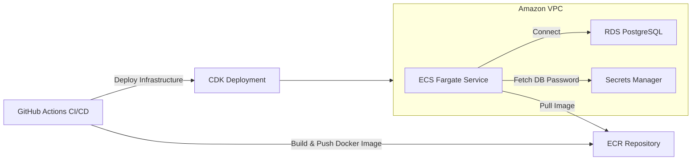

# AWS Backend

This repository implements a containerized Node.js backend using TypeScript and Express. The backend interacts with a PostgreSQL database and is deployed on AWS using modern cloud-native practices. The infrastructure is defined using AWS CDK, and the entire CI/CD pipeline is automated via GitHub Actions using OIDC for secure AWS authentication.

---

## Architecture Diagram

Below is an overview of the system architecture:



### AWS Services
- **VPC**: Isolated network with public/private subnets
- **RDS**: Managed PostgreSQL database for `logdb`
- **ECS Fargate**: Runs containerized applications
- **Secrets Manager**: Manages database credentials
- **ECR**: Hosts Docker images
- **IAM**: Manages roles and permissions (OIDC for GitHub Actions)
- **CloudWatch**: Collects ECS task logs
- **CDK**: Infrastructure as Code deployment

### Application Stack
- **Backend**: Node.js/Express REST API
- **Database**: PostgreSQL with a simple `log` table
- **API Endpoints**:
  - `GET /log`: Retrieve logs
  - `POST /log`: Store JSON logs

### Security
- RDS in private subnet with restricted access
- Secrets management via AWS Secrets Manager
- Task execution IAM roles for ECS

### Development
- TypeScript/Node.js
- Docker containerization
- Infrastructure as Code using AWS CDK

## Local Development
1. Set environment variables in `.env`
2. `npm install` in backend directory
3. `npm run dev` to start development server

## Deployment
1. Clone the repository:
   ```bash
   git clone https://github.com/safiulalam99/aws-backend.git
   cd aws-backend
   ```

2. Set up AWS environment:
   - Ensure you have an AWS account with necessary permissions
   - Configure AWS CLI:
     ```bash
     aws configure
     ```

3. Install dependencies:
   ```bash
   npm install -g aws-cdk
   npm install
   ```

4. Bootstrap CDK environment:
   ```bash
   cdk bootstrap aws://YOUR_ACCOUNT_ID/YOUR_AWS_REGION
   ```

5. Deploy the application:
   ```bash
   cdk deploy --require-approval never
   ```

## Testing
1. Get the service URL from AWS Console or deployment output

2. Send a test request:
   ```bash
   curl -X POST http://your-backend-url:3000/log \
        -H "Content-Type: application/json" \
        -d '{"key": "value"}'
   ```

3. Verify the response to confirm successful deployment
